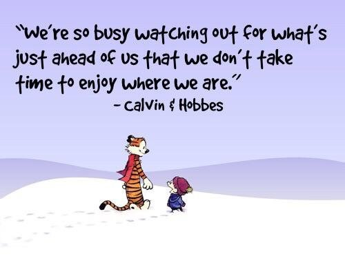

## Superdeveloper.net / Gertjan van Heertum


### About me
- [My GitHub](https://github.com/gvheertum)
- [My LinkedIn](https://www.linkedin.com/in/gertjanvanheertum/)
``` 
//Todo: Implement
```


### Keywords
[TaxModel](https://github.com/TaxModel), SuperDeveloper, [Pulsatrix](https://github.com/pulsatrixbv), .NET, C#, Architecture, Azure, SQL, Javascript, MVC

### Sub projects
*Not really much to see, but these are public anyway, so enjoy ;)*
- [ePubScan](https://superdeveloper.net/ePubScan)
- [QuoteClock](https://superdeveloper.net/QuoteClock)
- [SimplyCrawl](https://superdeveloper.net/SimplyCrawl)
- [Swift Development Playgrounds (BigNerdRange books)](https://superdeveloper.net/BigNerdRanch-SwiftDevelopment)
- [Swift iOS Development Playgrounds (BigNerdRange books)](https://superdeveloper.net/BigNerdRanch-iOSDevelopment)
- [CodinGame Challenges](https://superdeveloper.net/CodinGame)
``` 
//TODO: Showcase more projects!
```
